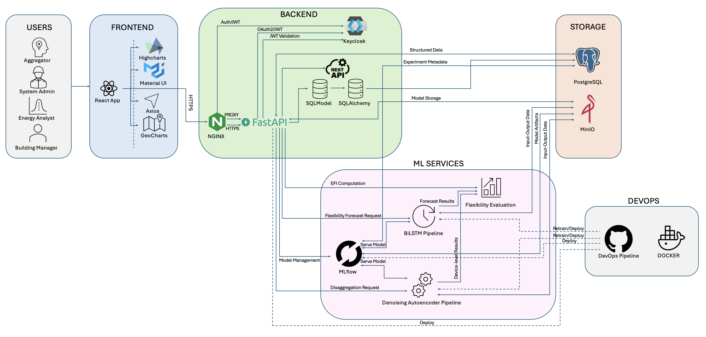

# Backend

### Getting started

This is a git repo for the backend and functionalities of the FLEXiT Tool.

The Techincal Architecture of the Tool is as shown below:

 

## FastAPI

This is the folder for the development of the Backend for the FLEXiT tool.

In the apisrc folder the developments should be created and it will automatically integrate them into the fast api.

The Documentation can be found here [click here](https://flexibility-backend.dedalus.epu.ntua.gr/docs)

## MinIO
Just run docker-compose up -d in the VM.

A Postgres database (parameter logging) and a minIO server (model store) are also automatically deployed.

For accessing MinIO [click here](http://dedalus.epu.ntua.gr:9000/minio/)